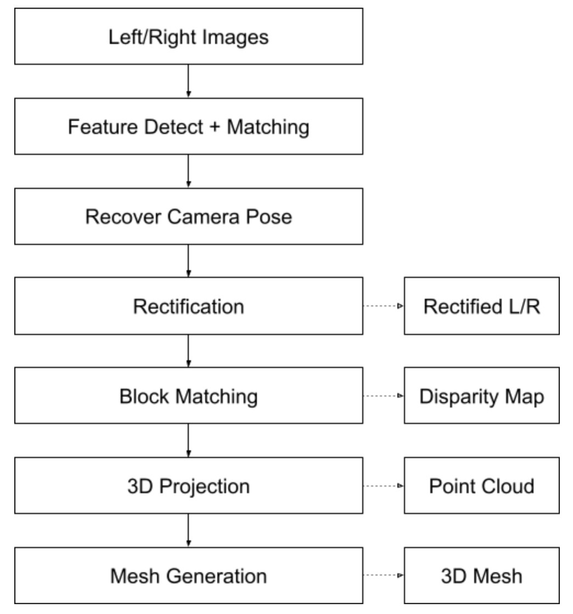
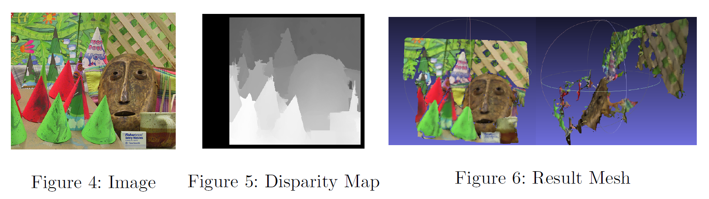

# Stereo Reconstruction

PCT-CIC Paper: <a href="/docs/PCT-CIC_Paper.pdf" class="image fit"> Here </a>

PCT Paper: https://arxiv.org/pdf/2012.09688.pdf

CurveNet Paper: https://arxiv.org/abs/2105.01288


## Environment to Reproduce the Trainings

[YAML File](project_env.yaml)

## Intro

<p align="justify"> Stereo reconstruction aims to obtain a 3D mesh from a pair of images of the same static scene. The processing pipeline shown in Fig.\ref{fig:pipeline} is split into two main stages: In the first stage we find suitable feature points in the two images and their descriptors. Then we use feature point matching based on FLANN and brute-force methods to obtain corresponding feature points in the images. This information allows us to retrieve the essential matrix and recover the rigid body motion between two cameras, and then to rectify the two images.

In the second stage we compute the disparity map using block matching algorithms such as StereoBM and StereoSGBM. The disparity map together with the camera intrinsics and rectification information allows us to reproject the pixels in the image into 3D space. After the reprojection we compute these points' normals and generated the mesh. </p>

<p float="center">
  
</p>


## Method

<p align="justify">  All of the input stereo pairs are taken in a static scene either simultaneously or in a very short period of time, and have a small baseline. Meaning that the relative rotation and translation between the camera positions are fairly small. 

Stereo reconstruction can be described as: for a given pair of stereo images, the goal is to employ stereo matching in order to produce a disparity map and from that reconstruct a mesh representation of the 3D scene. Followingly, subsequent project steps are:

1. Feature Detection and Image Rectification

2. Block Matching and Disparity Map Generation

3. Reprojection to 3D

4. Mesh Generation from Point Cloud </p>


## Result

<p float="center">
  
</p>

<p align="justify"> We have reconstructed a 3D mesh based on a pair of images of a static scene.  We first used feature point detection and matching to rectify our input images.Then we employed stereo matching in order to produce a disparity map that allowed us to reconstruct a mesh representation of the 3D scene. In  the  future,  our  approach  could  be  extended  to  perform  reconstruction  based  on a  collection  of  images  of  the  same  static  scene. This  is  known  as multi-view  stereo reconstruction and would allow us to obtain more 3D geometry information and thus more meaningful reconstructions in many scenarios. </p>


## Citation

<p align="justify"> Our project employs the following feature descriptor architectures. Refer to the respective authors/repositories for further inspection. </p>

SIFT:

```
@article{lowe2004sift,
  title={Distinctive image features from scale-invariant keypoints},
  author={Lowe, David G},
  journal={International journal of computer vision},
  volume={60},
  number={2},
  pages={91--110},
  year={2004},
  publisher={Springer}
}
```

ORB:

```
@inproceedings{rublee2011orb,
  title={ORB: An efficient alternative to SIFT or SURF},
  author={Rublee, Ethan and Rabaud, Vincent and Konolige, Kurt and Bradski, Gary},
  booktitle={2011 International conference on computer vision},
  pages={2564--2571},
  year={2011},
  organization={Ieee}
}
```
